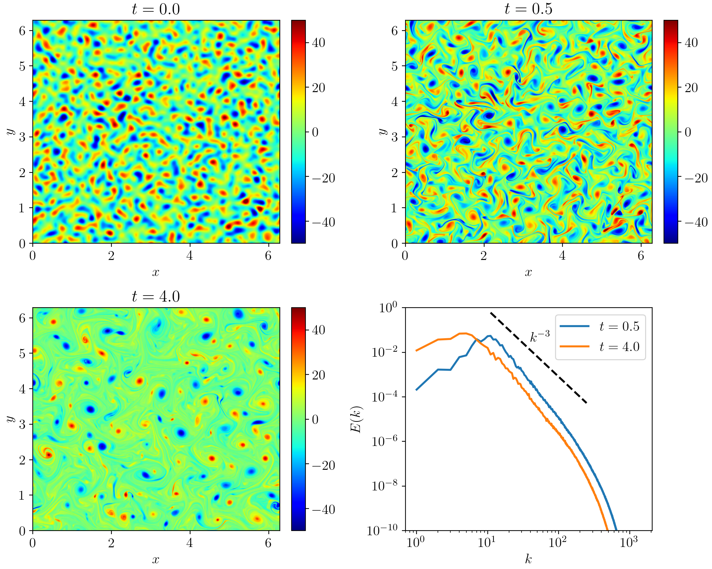

# 2D_Turbulence
This repository contains code for data-driven LES of two-dimensional turbulence.

 Visualization of the vorticity field and energy spectrum at different time instances for Re = 16000 with grid resolution $2048 \times 2048$.

